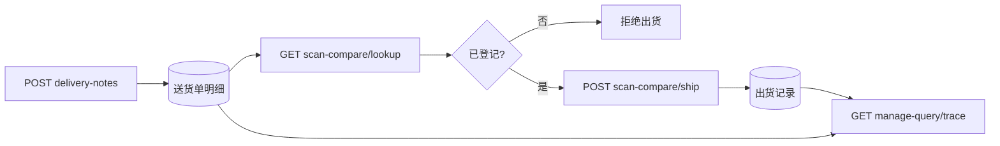

# 工厂仓储系统 — 后端接口对接文档（汇总版）

> 版本：V1.0.0  
> 前端工程：`uni-preset-vue-vite`  
> 本文档合并送货单录入、出货比对、管理查询三大模块，供后端一次性开发与联调。  
> 分模块旧文档（可作参考）：`backend-warehouse-delivery-note-api.md`、`backend-warehouse-scan-compare-api.md`、`backend-warehouse-manage-query-api.md`

---

## 1. 系统概述

### 1.1 业务模块

| 模块 | 前端页面 | 功能简述 |
|------|----------|----------|
| 录入送货单 | `pages/warehouse/shipment-entry` | 拍照/上传送货单 OCR 识别，或手工录入；数据入库作为「登记/入库」依据 |
| 出货比对 | `pages/warehouse/scan-compare` | 手工输入箱单号，与库内送货单比对；通过则填写本次出货数量并扣减余量 |
| 管理查询 | `pages/warehouse/manage-query` | 按生产批号、机型（销售型号）追溯出入库与余量 |

### 1.2 业务流程

```
录入送货单 ──► 送货单主表 + 明细表（入库登记）
                    │
                    ▼
出货比对 ──────► 按箱单号/批次匹配明细 ──► 校验余量 ──► 写出货记录（出库）
                    │
                    ▼
管理查询 ◄──── 汇总：今日/累计 入库、出库、剩余
```

### 1.3 接口基础约定

| 项目 | 说明 |
|------|------|
| Base URL | `{host}/api`（示例：`https://hvoqpnuvbtfp.sealosbja.site/api`） |
| 鉴权 | `Authorization: Bearer <token>`，与考勤系统共用登录态 |
| Content-Type | JSON 接口：`application/json`；上传识别：`multipart/form-data` |
| 日期格式 | `YYYY-MM-DD`（如 `2026-05-19`） |
| 数量单位 | PCS，整型或数值，字段统一后缀 `QuantityPcs` |
| 错误响应 | 建议 `{ "error": { "code": "NOT_FOUND", "message": "..." } }`；HTTP 4xx/5xx 与 code 一致 |

### 1.4 接口清单（速查）

| 方法 | 路径 | 模块 |
|------|------|------|
| POST | `/warehouse/delivery-notes/recognize` | 送货单 OCR |
| POST | `/warehouse/delivery-notes` | 提交送货单 |
| GET | `/warehouse/scan-compare/lookup` | 出货比对查询 |
| POST | `/warehouse/scan-compare/ship` | 确认出货 |
| GET | `/warehouse/manage-query/trace` | 管理查询追溯 |

---

## 2. 编码与数据规则

### 2.1 生产批号与箱单号

| 类型 | 格式 | 示例 |
|------|------|------|
| 生产批号 | `GR-HFYZBU` + **8 位数字** + **可选后缀**（`01H`/`02H`/`01B`/`02B` 等） | `GR-HFYZBU26040149`、`GR-HFYZBU2603014502B` |
| 箱单号 | `HFSYHFYZBU` + **8 位数字** + **可选后缀** + **6 位流水号** | `HFSYHFYZBU26040149000001`、`HFSYHFYZBU2607055201H000001` |

- **批次匹配码 `batchKey`**：前缀后的 **前 8 位数字**（例：`26040149`；`GR-HFYZBU2607055201H` → `26070552`；箱单 `HFSYHFYZBU2607055201H000001` → `26070552`）。流水号与后缀不参与匹配；**箱单后缀在流水号之前**。
- 后端用 `batchKey` 关联送货单明细；出货记录建议保存完整 `boxNo`（含后缀）。

### 2.2 送货单字段（全系统统一）

**表头**

| 字段 | 中文 | 说明 |
|------|------|------|
| `customerName` | 收货客户 | |
| `shippingDate` | 发运日 | |

**明细（可多行）**

| 字段 | 中文 | 说明 |
|------|------|------|
| `customerOrderNo` | 客户订单号 | |
| `salesModel` | 销售型号 | 管理查询中的「机型」 |
| `productCode` | 产品编码 | |
| `quantityPcs` | 数量 | 登记数量，计入入库 |
| `productionBatchNo` | 生产批号 | 含 `batchKey` |
| `deliveryNoteNo` | 送货单号 | |

### 2.3 OCR 识别标签（按字段名，非红框）

表头可选标签：`收货客户`、`客户名称`、`收货单位`；`发运日`、`发货日期`、`发运日期`、`出货日期`。

明细可选标签：`客户订单号`、`订单号`；`销售型号`、`型号`；`产品编码`、`物料编码`、`料号`；`数量`、`数量PCS`；`生产批号`、`批号`；`送货单号`、`出货单号`。

识别模式：前端上传时固定传 `recognizeMode=field`。

---

## 3. 模块一：录入送货单

前端：`pages/warehouse/shipment-entry`

### 3.1 识别送货单（OCR）

**`POST /api/warehouse/delivery-notes/recognize`**

- Content-Type：`multipart/form-data`
- 表单字段：
  - `file`：图片（拍照/相册）
  - `recognizeMode`：固定 `field`（按字段名匹配，不要红框区域）

**识别实现建议**

1. OCR 得全文后，按中文标签「标签：值」或表格表头+数据行解析。
2. 优先返回结构化 JSON；暂不能结构化时可返回 `rawText`，前端会兜底解析（准确度较低）。

**响应示例（推荐）**

```json
{
  "header": {
    "customerName": "创维电器股份有限公司",
    "shippingDate": "2026-05-19"
  },
  "items": [
    {
      "customerOrderNo": "N032402-000494-001",
      "salesModel": "S.XG01Z BCW.6",
      "productCode": "002.027.0004083",
      "quantityPcs": 1500,
      "productionBatchNo": "GR-HFYZBU26040149",
      "deliveryNoteNo": "HFYD260519023630"
    }
  ]
}
```

**响应示例（仅全文）**

```json
{
  "rawText": "收货客户：创维电器股份有限公司\n发运日：2026-05-19\n客户订单号：...\n"
}
```

可选扩展：`fields` 扁平对象，或 `recognizedFields: [{ "key", "label", "value" }]`。

---

### 3.2 提交送货单

**`POST /api/warehouse/delivery-notes`**

**请求体**

```json
{
  "customerName": "创维电器股份有限公司",
  "shippingDate": "2026-05-19",
  "imageUrl": "",
  "items": [
    {
      "customerOrderNo": "N032402-000494-001",
      "salesModel": "S.XG01Z BCW.6",
      "productCode": "002.027.0004083",
      "quantityPcs": 1500,
      "productionBatchNo": "GR-HFYZBU26040149",
      "deliveryNoteNo": "HFYD260519023630"
    }
  ]
}
```

- `imageUrl`：可选，送货单图片 URL（前端当前多为空，若需留档可另做上传接口）。
- `items`：至少一行有效明细；`quantityPcs` 为数字。

**响应示例**

```json
{
  "id": "dn_202605280001",
  "saved": true
}
```

**入库逻辑**：明细写入后，按 `productionBatchNo`（及 `batchKey`）累计 **登记总量**，作为后续出货比对的「可出上限」来源。

---

## 4. 模块二：出货比对

前端：`pages/warehouse/scan-compare`  
交互：**仅手工输入箱单号**（无扫码），查询比对通过后填写本次出货数量。

### 4.1 查询比对

**`GET /api/warehouse/scan-compare/lookup`**

**Query 参数**

| 参数 | 说明 |
|------|------|
| `boxNo` | 完整箱单号（推荐） |
| `batchKey` | 8 位批次码；可与 `boxNo` 同时传 |

**处理逻辑**

1. 由 `boxNo` 解析出 `batchKey`（中间 8 位），或直接使用 `batchKey`。
2. 在送货单明细中查找 `productionBatchNo` 匹配该 `batchKey` 的记录。
3. **未找到**：`404` 或 `{ "matched": false, "message": "..." }`。
4. **找到**：返回登记信息与余量。

**响应示例（matched: true）**

```json
{
  "matched": true,
  "batchKey": "26040149",
  "productionBatchNo": "GR-HFYZBU26040149",
  "customerName": "创维电器股份有限公司",
  "shippingDate": "2026-05-19",
  "customerOrderNo": "N032402-000494-001",
  "salesModel": "S.XG01Z BCW.6",
  "productCode": "002.027.0004083",
  "deliveryNoteNo": "HFYD260519023630",
  "totalQuantityPcs": 4500,
  "shippedQuantityPcs": 1500,
  "remainingQuantityPcs": 3000
}
```

| 字段 | 计算建议 |
|------|----------|
| `totalQuantityPcs` | 同一 `batchKey` 下送货单明细 `quantityPcs` 之和 |
| `shippedQuantityPcs` | 出货记录表该批次累计 |
| `remainingQuantityPcs` | `totalQuantityPcs - shippedQuantityPcs` |

**响应示例（未登记）**

```json
{
  "matched": false,
  "message": "该箱单对应批次未在送货单中登记，不允许出货"
}
```

---

### 4.2 确认出货

**`POST /api/warehouse/scan-compare/ship`**

**请求体**

```json
{
  "boxNo": "HFSYHFYZBU26040149000001",
  "batchKey": "26040149",
  "productionBatchNo": "GR-HFYZBU26040149",
  "quantityPcs": 500
}
```

**处理逻辑**

1. 再次校验 `batchKey` 在送货单中存在。
2. 校验 `quantityPcs` ≤ 当前 `remainingQuantityPcs`。
3. **箱单唯一**：若请求含 `boxNo` 且该箱已出货 → 拒绝（`BOX_ALREADY_SHIPPED`），详见 [`backend-warehouse-box-unique.md`](./backend-warehouse-box-unique.md)。
4. 写入出货记录；扣减余量。（`box_no` 建议唯一索引）

**响应示例**

```json
{
  "success": true,
  "shippedQuantityPcs": 2000,
  "remainingQuantityPcs": 2500
}
```

---

## 5. 模块三：管理查询

前端：`pages/warehouse/manage-query`  
按 **生产批号**、**机型（salesModel）** 追溯；至少传一个条件，可 AND 组合。

### 5.1 追溯查询

**`GET /api/warehouse/manage-query/trace`**

**Query 参数**

| 参数 | 说明 |
|------|------|
| `productionBatchNo` | 完整批号，如 `GR-HFYZBU26040149` |
| `batchKey` | 8 位匹配码 |
| `salesModel` | 销售型号 / 机型，建议支持模糊匹配 |

**响应示例**

```json
{
  "list": [
    {
      "id": "trace_001",
      "batchKey": "26040149",
      "productionBatchNo": "GR-HFYZBU26040149",
      "salesModel": "S.XG01Z BCW.6",
      "productCode": "002.027.0004083",
      "customerName": "创维电器股份有限公司",
      "customerOrderNo": "N032402-000494-001",
      "deliveryNoteNo": "HFYD260519023630",
      "todayInboundQuantityPcs": 500,
      "todayOutboundQuantityPcs": 200,
      "cumulativeInboundQuantityPcs": 4500,
      "cumulativeOutboundQuantityPcs": 1500,
      "cumulativeRemainingQuantityPcs": 3000
    }
  ],
  "summary": {
    "todayInboundQuantityPcs": 500,
    "todayOutboundQuantityPcs": 200,
    "cumulativeInboundQuantityPcs": 4500,
    "cumulativeOutboundQuantityPcs": 1500,
    "cumulativeRemainingQuantityPcs": 3000
  }
}
```

**数量字段说明**

| 字段 | 含义 |
|------|------|
| `todayInboundQuantityPcs` | 今日入库（当日送货单登记） |
| `todayOutboundQuantityPcs` | 今日出库（当日出货比对确认） |
| `cumulativeInboundQuantityPcs` | 累计入库 |
| `cumulativeOutboundQuantityPcs` | 累计出库 |
| `cumulativeRemainingQuantityPcs` | 累计剩余 = 累计入库 − 累计出库 |

**统计口径建议**

- 分组维度：`productionBatchNo` + `salesModel`（同一批号多机型多行）。
- **入库**：送货单明细 `quantityPcs`。
- **出库**：出货记录表（`scan-compare/ship`）。
- **今日**：按服务器业务日 0:00–24:00 过滤 `created_at`。
- `summary` 可选；不传时前端对 `list` 求和。

**无数据**

```json
{
  "list": [],
  "summary": null
}
```

---

## 6. 数据库设计建议

### 6.1 送货单主表 `warehouse_delivery_notes`

| 字段 | 类型 | 说明 |
|------|------|------|
| id | PK | |
| customer_name | string | 收货客户 |
| shipping_date | date | 发运日 |
| image_url | string | 可选 |
| created_by | FK user | |
| created_at | datetime | |

### 6.2 送货单明细 `warehouse_delivery_note_items`

| 字段 | 类型 | 说明 |
|------|------|------|
| id | PK | |
| delivery_note_id | FK | |
| customer_order_no | string | |
| sales_model | string | 机型 |
| product_code | string | |
| quantity_pcs | int | 登记数量 |
| production_batch_no | string | 如 GR-HFYZBU26040149 |
| batch_key | string | 8 位，建议冗余索引 |
| delivery_note_no | string | |
| created_at | datetime | 入库时间 |

**索引建议**：`batch_key`、`production_batch_no`、`sales_model`。

### 6.3 出货记录 `warehouse_shipments`

| 字段 | 类型 | 说明 |
|------|------|------|
| id | PK | |
| box_no | string | 箱单号 |
| batch_key | string | 8 位 |
| production_batch_no | string | |
| quantity_pcs | int | 本次出货 |
| delivery_note_item_id | FK | 可选 |
| operator_id | FK user | |
| created_at | datetime | 出库时间 |

**索引建议**：`batch_key`、`created_at`。

---

## 7. 联调与交付检查表

### 7.1 后端实现顺序（建议）

1. 送货单提交 `POST /delivery-notes` + 表结构  
2. 出货比对查询 `GET /scan-compare/lookup` + 出货 `POST /scan-compare/ship`  
3. 管理查询 `GET /manage-query/trace`  
4. OCR 识别 `POST /delivery-notes/recognize`（可最后接入第三方 OCR）

### 7.2 接口完成自检

- [ ] 所有接口 Bearer 鉴权，401 时前端跳转登录  
- [ ] 批号/箱单号解析与 `batchKey` 规则一致  
- [ ] 出货数量不超过剩余；并发出货需考虑事务/锁  
- [ ] 管理查询今日/累计与送货单、出货记录数据一致  
- [ ] OCR 支持 `header`+`items` 或 `rawText` 至少一种  

### 7.3 前端联调入口

| 功能 | 路径 |
|------|------|
| 仓储首页 | `pages/warehouse/index` |
| 录入送货单 | `pages/warehouse/shipment-entry` |
| 出货比对 | `pages/warehouse/scan-compare` |
| 管理查询 | `pages/warehouse/manage-query` |

前端 API 封装：`src/utils/api/warehouse.js`  
批号/箱单解析：`src/utils/warehouse/boxCodeParser.js`  
送货单 OCR 兜底解析：`src/utils/warehouse/deliveryNoteParser.js`

---

## 8. 附录：模块关系示意



---

**文档维护**：业务或字段变更时，请同步更新本文档及前端 `warehouse.js` / 解析工具。如有疑问可对照前端页面实际请求与展示字段。
